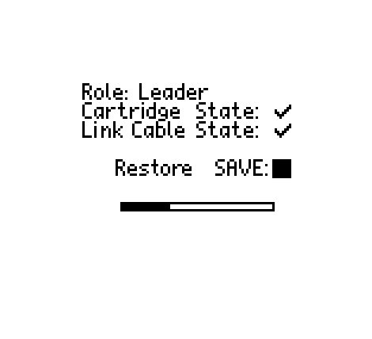

# Game Boy Save Manager (gb-save-manager.gb)
A custom Gameboy ROM for backing up and restoring your SAVE files on your old school Gameboy game cartridges using a Link-Cable and two Gameboys!





## Use cases
* You want to store your Gameboy cartridge saves in a safe place to be prepared for when the battery life eventually runs out (and the save is lost).
* You have a SAVE file you want to move from a game cartridge onto a micro SD like flash cartridge or emulator device (or vise versa).

## Why
There are certain hardware products you can buy to backup and restore SAVE files from and to your Gameboy cartridges. However, many of us probably have all the necessary hardware at home to do this already, so buying another piece of hardware for 35-50$ just to do this seems unecessary.

## Required hardware
What you need is:
* 2x Gameboys, of any of these models: 
  * Gameboy (DMG)*
  * Gameboy Pocket (GBP)
  * Gameboy Color (GBC)
  * Gameboy Advance (GBA)
  * Gameboy Advance SP (GBA SP)

* Gameboy Color Link-Cable (DMG requires an adapter)
* A Gameboy Flash Cartridge, for example:
  * EVERDRIVE-GB X3/X5/X7
  * EZ-FLASH Junior
* A Gameboy or Gameboy Color game that you want to backup/restore the SAVE file to/from

\* Since DMG locks down the cartridge slot, maximum 1 of this device can be used unless you modify the power switch.

## Supported Cartridge Types
Gameboy Cartridges has different chips which works slightly differently. Here is a list of supported Cartridge Types:

* MBC1
* MBC3
* MBC5 (Rumble cartridges should work but is untested since I don't a game to test)

Cartridges of this type is unsupported as of now, but planned:
* MBC2 (Again, don't own any game with this type)

A few games uses MBC2, most of them are using MBC 1, 3 or 5, so most official game cartridges should be supported.

There are also a bunch of multi-rom cartridge and unofficial cartridges. These are most likely unsupported.

## How to use it

The ROM explains what you need to do, but here is a crash-course:
1. Boot up gb-save-manager.gb from your flash cartridge
2. Unplug the flash cartridge
3. Insert your game to backup/restore
4. Boot up gb-save-manager.gb from your flash cartridge on a 2nd Gameboy
5. Connect a Gameboy Color Link-Cable to both devices
6. Press button to start the backup/restore process

If you choose `Backup`, the save data should be stored on your flash cartridge (typically named `gb-save-manager.sav` or similar).

If you choose `Restore`, the save data on the flash cartridge for `gb-save-manager` (typically named `gb-save-manager.sav` or similar) is now on the game cartridge.

## Tips and Tricks
Sometimes the Gameboy can reset when inserting or ejecting a Cartridge. A good technique to avoid this is to nudge the cartridge from side-to-side, little-by-little slowly. This works good on a Gameboy Pocket and Gameboy Color. On Gameboy Advance SP, it's usually best to slightly rotate the cartridge to either right or left, so that the cartridge comes in at a slight angle rather than strait on.

The general idea is to avoid that all pins connect/disconnect at the same time. This can cause an in-rush of current to the cartridge from the Gameboy which is the reason the Gameboy resets.

Some cartridges are better or worse than others. You typically want a cartridge with as low power consumption as possible. Through testing, I have found out that this issue is much less of a problem on the EVERDRIVE compared to the EZ-FLASH.

## How to build

You need `docker` and `make` installed. Then just run `make` to build it. Result should be in `build/gb-save-manager/gb-save-manager.fixed.gbc`

```bash
make
```
