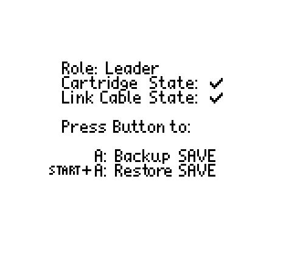

# Game Boy Save Manager (gb-save-manager.gb)
A custom Gameboy ROM for backing up and restoring your SAVE files on your old school Gameboy game cartridges using a Link-Cable and two Gameboys!

  _  |  _  
:---:|:---:
 | 
 | 

## Use cases
* You want to store your Gameboy cartridge saves in a safe place to be prepared for when the battery life eventually runs out (and the save is lost).
* You have a SAVE file you want to move from a game cartridge onto a micro SD like flash cartridge or emulator device (or vise versa).

## Why
There are certain hardware products you can buy to backup and restore SAVE files from and to your Gameboy cartridges. However, many of us probably have all the necessary hardware at home to do this already, so buying another piece of hardware for 35-50$ just to do this seems unecessary.

## Required hardware
What you need is:
* 2x Gameboys, of any of these models: 
  * Gameboy (DMG)*
  * Gameboy Pocket (GBP)
  * Gameboy Color (GBC)
  * Gameboy Advance (GBA)
  * Gameboy Advance SP (GBA SP)

* Gameboy Color Link-Cable (DMG requires an adapter)
* A Gameboy Flash Cartridge, for example:
  * EVERDRIVE-GB X3/X5/X7
  * EZ-FLASH Junior
* A Gameboy or Gameboy Color game that you want to backup/restore the SAVE file to/from

\* Since DMG locks down the cartridge slot, maximum 1 of this device can be used unless you modify the power switch.

## Supported Cartridge Types
Gameboy Cartridges has different chips which works slightly differently. Most if not all original Gameboy and Gameboy Color cartridges should be supported. Here is a list of supported Cartridge Mapper Types:

* MBC1
* MBC2** (From v1.1 and onwards)
* MBC3
* MBC5
* MBC5 with rumble pack **

\*\* Only tested in emulator since I don't own any game of this kind.

There are also a bunch of multi-rom cartridge and unofficial cartridges. These are most likely unsupported.

## How to use it

The ROM explains what you need to do, but here is an overview:
1. Boot up gb-save-manager.gb from your flash cartridge
2. Unplug the flash cartridge
3. Insert your game to backup/restore
4. Boot up gb-save-manager.gb from your flash cartridge on a 2nd Gameboy
5. Connect a Gameboy Color Link-Cable to both devices
6. Press button to start the backup/restore process

If you choose `Backup`, the save data should be stored on your flash cartridge (typically named `gb-save-manager.X.sav`\*\*\* or similar).

If you choose `Restore`, the save data on the flash cartridge for `gb-save-manager` (typically named `gb-save-manager.X.sav`\*\*\* or similar) is now on the game cartridge.

\*\*\* In the name `gb-save-manager.X.sav`, `X` is the version release, e.g `1.0` or `1.1`. The file ending might also be different. For example the EVERDRIVE uses `.srm` instead of the more common `.sav`. When restoring the a save, Double-check the naming of your other save files to make sure you use the correct naming. Otherwise the flash cart won't recognize the save file, and the restore process will fail.

## Tips and Tricks
After a backup, it's good to always boot another game from the flash cartridge before working with the save file (`gb-save-manager.X.sav`). This is because most flash cartridges doesn't copy over the save until it's necessary. So booting another game will force the flash cartridge to move the save from internal SRAM to the SD-card.

### Hot-swapping Game Cartridges
Sometimes the Gameboy can reset when inserting or ejecting a Cartridge. This is becuase of a voltage power drop. To mitigate this, turn off the volume and reduce screen brightness as much as possible so that the device uses as little power as possible.

When injecting a cartridge, a good technique is to nudge the cartridge from side-to-side, little-by-little slowly. This works good on a Gameboy Pocket and Gameboy Color. On Gameboy Advance SP, it's usually best to slightly rotate the cartridge to either right or left, so that the cartridge comes in at a slight angle rather than strait on.

The general idea is to avoid that all pins connect/disconnect at the same time. This can cause an in-rush of current to the cartridge from the Gameboy which is the reason the Gameboy resets.

Some cartridges are better or worse than others. You typically want a cartridge with as low power consumption as possible. Through testing, I have found out that this issue is much less of a problem on the EVERDRIVE compared to the EZ-FLASH.

## Troubleshooting

### I tried to restore the save file to my game cartridge, but the result is a wiped/empty save file
* When you restored the save, did the tile next to the "SAVE" text flicker similar to this image? If not, the flash cartridge could not read the save. Double check that the naming is the same as the name of the rom (`gb-save-manager.X.sav` or similar) but with correct file ending (`sav`/`srm` depending on the flash cartridge).


* If you did see the flicker but it still failed, Have you tried to load the save into an emulator or on the flash cartridge? It might be currupt.

* If the save file seems to work elsewhere and the restore process shows a flickering tile as mentioned, but still yield a wiped/empty save file after a restore, please file an issue and describe what game are working with and each step you have tried.

## How to build

You need `docker` and `make` installed. Then just run `make` to build it. Result should be in `build/gb-save-manager/gb-save-manager.fixed.gbc`

```bash
make
```

## Test in emulator

You can use a standard build of mGBA to test it by using its built-in support for multiplayer. However, it becomes quite tedious to click "New Multiplayer Window" -> "Open ROM" every time you want to test. The best way to test fast (every build) is to grab a certain version of mGBA (https://github.com/Gronis/mgba) that has added support for cli to specify multiple roms in a single command like and opens both of them in multiplayer mode. Once built, you can use it to test an actual save transfer inside the emulator. Here is what it would look like on MacOS which I use:

```bash
make && ~/mgba/build/qt/mGBA.app/Contents/MacOS/mGBA build/gb-save-manager/gb-save-manager.fixed.gbc build/gb-companion/gb-companion.fixed.gbc
```
